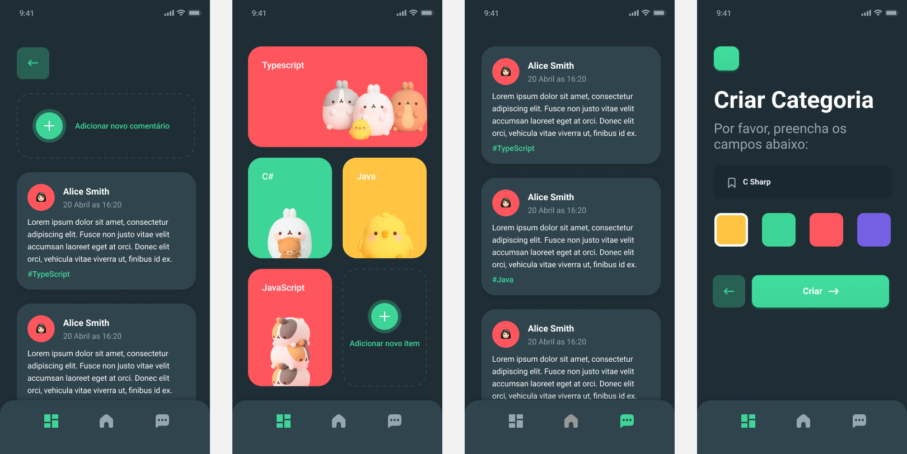

<h1 align="center">
  
</h1>

<h4 align="center">
  CursoLIGA - Bird App
</h4>

Desenvolvimento do curso promovido pelo LIGA FACENS sobre desenvolvimento mobile com angular, ionic, typescript, nestjs e capacitor.

## Projeto

É um aplicativo para criar categorias e comentários sobre diversos assuntos aleatórios que você goste com outras pessoas.

